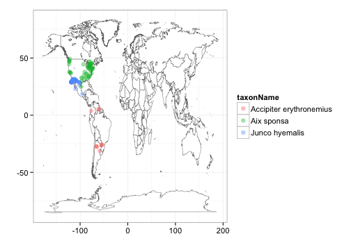

opts_chunk$set(warning=FALSE, message=FALSE, comment=NA, cache=FALSE)

*********

## Example rOpenSci code

*********

### Getting taxonomic data from many sources

```r
library(taxize)
```


### Getting data from GBIF

```r
library(rgbif)
```

```
## Attaching package: 'rgbif'
```

```
## The following object(s) are masked from 'package:taxize':
## 
## capwords
```

```r
# Query for many species
splist <- c("Accipiter erythronemius", "Junco hyemalis", "Aix sponsa")
out <- lapply(splist, function(x) occurrencelist(x, coordinatestatus = T, maxresults = 50))
lapply(out, head)
```

```
## [[1]]
##                 taxonName   country decimalLatitude decimalLongitude
## 1 Accipiter erythronemius Argentina          -25.91           -54.36
## 2 Accipiter erythronemius Argentina          -27.35           -65.60
## 3 Accipiter erythronemius Argentina          -27.35           -65.60
## 4 Accipiter erythronemius Argentina          -25.86           -54.52
## 5 Accipiter erythronemius Argentina          -27.35           -65.60
## 6 Accipiter erythronemius Argentina          -25.86           -54.52
##   catalogNumber earliestDateCollected latestDateCollected
## 1         38199                  <NA>                <NA>
## 2         42228                  <NA>                <NA>
## 3         42227                  <NA>                <NA>
## 4         38015                  <NA>                <NA>
## 5         42229                  <NA>                <NA>
## 6         39196                  <NA>                <NA>
## 
## [[2]]
##        taxonName country decimalLatitude decimalLongitude
## 1 JUNCO HYEMALIS  MÉXICO           28.70           -101.2
## 2 JUNCO HYEMALIS  MÉXICO           30.05           -108.4
## 3 JUNCO HYEMALIS  MÉXICO           29.00           -118.3
## 4 JUNCO HYEMALIS  MÉXICO           30.05           -108.4
## 5 JUNCO HYEMALIS  MÉXICO           30.97           -115.7
## 6 JUNCO HYEMALIS  MÉXICO           31.05           -115.5
##                  catalogNumber earliestDateCollected latestDateCollected
## 1         12675 / 16928 / E018            1956-12-06          1956-12-06
## 2        36696 / 163716 / E018            1954-11-02          1954-11-02
## 3         14659 / 81036 / E018            1896-09-19          1896-09-19
## 4        36692 / 163712 / E018            1954-11-02          1954-11-02
## 5 not recorded / 251289 / E018                  <NA>                <NA>
## 6         14655 / 81032 / E018            1893-05-10          1893-05-10
## 
## [[3]]
##    taxonName       country decimalLatitude decimalLongitude
## 1 AIX SPONSA        MÉXICO           24.95           -98.10
## 2 Aix sponsa United States           36.96          -119.74
## 3 Aix sponsa United States           36.87          -119.80
## 4 Aix sponsa United States           32.30           -86.62
## 5 Aix sponsa United States           37.56          -122.00
## 6 Aix sponsa United States           36.21           -86.52
##                    catalogNumber earliestDateCollected latestDateCollected
## 1   not recorded / 254870 / E018            1951-02-23          1951-02-23
## 2 SJBR2928PointCountVCP10_251102                  <NA>                <NA>
## 3       SJBR2903PointCountFR5015            1998-05-05          1998-05-05
## 4                    OBS17693079            2001-02-18          2001-02-18
## 5                    OBS18454584            2002-02-16          2002-02-16
## 6                    OBS17934629            2001-02-18          2001-02-18
```

```r
gbifmap(out)
```

```
## Rendering map...plotting 109 points
```

 

