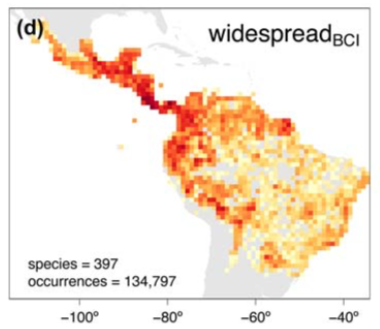
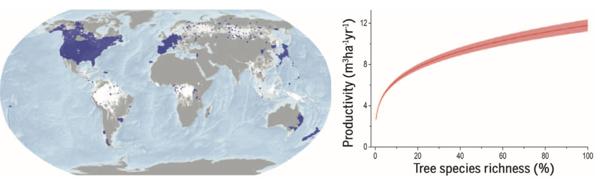
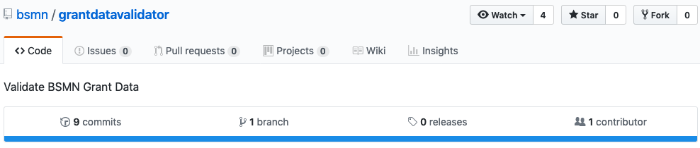
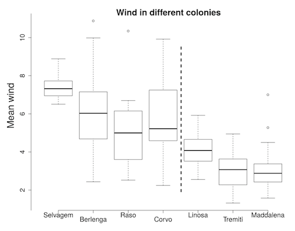

## .large[Why Data Packages?]

<ul>
  <li style="font-size:40px";>Reduce duplicated effort by each researcher</li>
  <li style="font-size:40px";>One best way to get data XYZ</li>
  <li style="font-size:40px";>Reduced user error</li>
  <li style="font-size:40px";>Allow researchers to focus on the science</li>
</ul>

---

## .large[Data Packages: Caveats]

<ul>
  <li style="font-size:40px";>User base (# of people) for data pkgs small relative to utilities</li>
  <ul>
    <li style="font-size:40px";>... attracts fewer contributors</li>
    <li style="font-size:40px";>... &amp; all the carry on effects of above</li>
  </ul>
  <li style="font-size:40px";>Pkg can get out of sync with data source's API</li>
  <li style="font-size:40px";>Risk leaving out metadata/context</li>
</ul>

---

## .large[rOpenSci Data Packages]

<ul>
  <li style="font-size:40px";>Biological occurrences</li>
  <li style="font-size:40px";>Taxonomy</li>
  <li style="font-size:40px";>Data utilities</li>
</ul>

<br>

<h2 style="color:grey">find more: <a href="https://ropensci.org/packages/">ropensci.org/packages</a></h2>

---

## .large[Occurrence Data Packages]

<ul>
  <li style="font-size:30px";><a href="https://github.com/ropensci/spocc">spocc</a> - Biodiversity data toolbelt</li>
  <li style="font-size:30px";><a href="https://github.com/ropensci/rgbif">rgbif</a> - GBIF data</li>
  <li style="font-size:30px";><a href="https://github.com/ropensci/ecoengine">ecoengine</a> - Berekeley Ecoengine client</li>
  <li style="font-size:30px";><a href="https://github.com/ropensci/rinat">rinat</a> - iNaturalist client</li>
  <li style="font-size:30px";><a href="https://github.com/ropensci/rbison">rbison</a> - USGS BISON client</li>
  <li style="font-size:30px";><a href="https://github.com/ropensci/rebird">rebird</a> - eBird data via their API</li>
  <li style="font-size:30px";><a href="https://github.com/CornellLabofOrnithology/auk">auk</a> - eBird bulk data</li>
  <li style="font-size:30px";><a href="https://github.com/ropensci/rvertnet">rvertnet</a> - VertNet data</li>
  <li style="font-size:30px";><a href="https://github.com/ropensci/rfishbae">rfishbase</a> - Fishbase.org data</li>
  <li style="font-size:30px";><a href="https://github.com/ropensci/finch">finch</a> - Handle Darwin Core</li>
</ul>

---

## .large[Data package patterns]

<h3>Or at least patterns we strive towards ...</h3>

<ul>
  <li style="font-size:30px";>HTTP requests</li>
  <li style="font-size:30px";>Cache downloaded data for FTP/similar files</li>
  <li style="font-size:30px";>Return data.frame's: facilitates downstream processing</li>
  <li style="font-size:30px";>Make it easy to cite data providers</li>
  <li style="font-size:30px";>Incorporate metadata</li>
</ul>

---

## .large[rgbif usage]

[Bemmels, et al. (2018) -- Filter-dispersal assembly of lowland Neotropical rainforests across the Andes](https://doi.org/10.1111/ecog.03473)



> _... records were obtained for each species ... using ... `rgbif` ... Quality controls were applied to ensure that occurrence records were correctly taxonomically identified and accurately georeferenced. In particular, records with the following issues were excluded ... invalid coordinates or geodetic datum; failed or suspicious coordinate reprojection; ... species name with no match ..._

~70 more e.g.'s at <https://github.com/ropensci/roapi/blob/master/data/citations.csv>

---

## .large[rgbif usage: Checklist recipe]

[TrIAS Project](https://github.com/trias-project) - [standardizing species checklist data to Darwin Core using R](https://ropensci.org/blog/2018/11/20/checklist-recipe/)

```
├── README.md              : Description of this repository
├── LICENSE                : Repository license
├── checklist-recipe.Rproj : RStudio project file
├── .gitignore             : Files and directories to be ignored by git
│
├── data
│   ├── raw                : Source data, input for mapping script
│   └── processed          : Darwin Core output of mapping script GENERATED
│
├── docs                   : Repository website GENERATED
└── src
    ├── dwc_mapping.Rmd    : Darwin Core mapping script, core functionality
    ├── _site.yml          : Settings to build website in /docs
    └── index.Rmd          : Template for website homepage
```


`r icon::fa_github()` <a href="https://github.com/ropensci/rgbif">rgbif</a>

---

## .large[Taxonomy Packages]

<ul>
  <li style="font-size:30px";><a href="https://github.com/ropensci/taxa">taxa</a> - Taxonomic R classes</li>
  <li style="font-size:30px";><a href="https://github.com/ropensci/taxize">taxize</a> - Taxonomic toolbelt (remote data)</li>
  <ul>
    <li style="font-size:30px";><a href="https://ropensci.github.io/taxize-book/">taxize book</a></li>
  </ul>
  <li style="font-size:30px";><a href="https://github.com/ropensci/taxizedb">taxizedb</a> - Leverage dumps of taxonomic database locally</li>
  <li style="font-size:30px";><a href="https://github.com/ropensci/ritis">ritis</a> - USGS's ITIS</li>
  <li style="font-size:30px";><a href="https://github.com/ropensci/rotl">rotl</a> - Open Tree of Life</li>
  <li style="font-size:30px";><a href="https://github.com/ropensci/rentrez">rentrez</a> - NCBI ENTREZ taxonomy database</li>
  <li style="font-size:30px";><a href="https://github.com/ropensci/worrms">worrms</a> - WORMS marine taxonomy</li>
  <li style="font-size:30px";><a href="https://github.com/ropensci/wikitaxa">wikitaxa</a> - Taxonomy data on Wikipedia</li>
  <li style="font-size:30px";><a href="https://github.com/ropenscilabs/zbank">zbank</a> - ZooBank</li>
  <li style="font-size:30px";><a href="https://github.com/ropensci/rgbif">rgbif</a> - GBIF taxonomy data</li>
</ul>

---

## .large[taxize usage]

[Liang, J., et al. (2016) -- Positive biodiversity-productivity relationship predominant in global forests](https://doi.org/10.1126/science.aaf8957)



> _there were ... 8,737 species ... We verified all ... names against 60 taxonomic data-bases, including NCBI, GRIN Taxonomy for Plants, Tropicos–Missouri Botanical Garden, and the International Plant Names Index, using the ‘taxize’ package in R_

~90 more e.g.'s at <https://github.com/ropensci/roapi/blob/master/data/citations.csv>

---

## .large[taxize project]

<h3>highlight a project that uses taxize ...</h3>


---

## .large[Utility Packages]

<ul>
  <li style="font-size:30px";><a href="https://github.com/ropensci/jqr">jqr</a> - R client for <a href="https://github.com/stedolan/jq/">jq</a>, the JSON processor</li>
  <li style="font-size:30px";><a href="https://github.com/ropensci/jsonld">jsonld</a> - JSON linked data</li>
  <li style="font-size:30px";><a href="https://github.com/ropensci/rerddap">rerddap</a> - ERDDAP server client</li>
  <li style="font-size:30px";><a href="https://github.com/ropensci/rdflib">rdflib</a> - RDF pkg, wrapped around Redland</li>
  <li style="font-size:30px";><a href="https://github.com/ropensci/assertr">assertr</a> - Assertions for analysis pipelines</li>
</ul>

---

## .large[assertr usage: eg]

[Brain Somatic Mosaicism Network](https://github.com/bsmn) - [Validate BSMN Grant Data ](https://github.com/bsmn/grantdatavalidator)



```r
 data %>%
    assertr::chain_start() %>%
    assertr::verify(nrow(data) == 3) %>%
    assertr::verify(assertr::is_uniq(nda_short_name)) %>%
    assertr::verify(assertr::not_na(grant)) %>%
    assertr::verify(dplyr::n_distinct(grant) == 1) %>%
    assertr::verify(nda_short_name %in% expected_nda_short_names) %>%
    assertr::chain_end() %>%
    tibble::as_tibble()
```

`r icon::fa_github()` <a href="https://github.com/ropensci/assertr">assertr</a>

---

## .large[rerddap usage: eg]

[Abolaffio, J., et al. (2018) -- Olfactory-cued navigation in shearwaters: linking movement patterns to mechanisms](https://doi.org/10.1038/s41598-018-29919-0)



<!--  -->

> _wind data were downloaded from the NOAA web site from the `rerdapp` package for R_

`r icon::fa_github()` <a href="https://github.com/ropensci/rerddap">rerddap</a>

---

## .large[Data integration: Steps]

<ul>
  <li style="font-size:40px";>Start with a species list</li>
  <li style="font-size:40px";>Clean names with <a href="https://github.com/ropensci/taxize">taxize</a></li>
  <li style="font-size:40px";>Get occurrence data with <a href="https://github.com/ropensci/rgbif">rgbif</a></li>
  <li style="font-size:40px";>Clean occurrence data w/ <a href="https://github.com/ropensci/rgbif">rgbif</a>, <a href="https://github.com/ropensci/scrubr">scrubr</a> or <a href="https://github.com/ropensci/CoordinateCleaner">CoordinateCleaner</a></li>
  <li style="font-size:40px";><a href="https://github.com/ropensci/assertr">assertr</a> to check data</li>
  <li style="font-size:40px";>Map with <a href="https://github.com/ropensci/mapr">mapr</a></li>
</ul>

---

## .large[Data integration: code]

```{r cache=TRUE}
#spp <- names_list("species")
spp <- read.csv("spp_list.txt", header = TRUE, stringsAsFactors = FALSE)$bad
spp2 <- taxize::gnr_resolve(spp, data_source_ids=11, canonical=TRUE)$matched_name2
dat <- rgbif::occ_data(scientificName = spp2, limit = 100)
# remove occurrences with COUNTRY_MISMATCH issues
# lapply(dat, function(w) rgbif::occ_issues(dat, -cum))
# FIXME: put back in place once rgbif thing fixed
# dat <- rgbif::occ_issues(dat, -cum)
# dat <- scrubr::coord_impossible(dat)
```

---

## .large[Data integration: code]

```r
 data %>%
    assertr::chain_start() %>%
    assertr::verify(nrow(data) == 3) %>%
    assertr::verify(assertr::is_uniq(nda_short_name)) %>%
    assertr::verify(assertr::not_na(grant)) %>%
    assertr::verify(dplyr::n_distinct(grant) == 1) %>%
    assertr::verify(nda_short_name %in% expected_nda_short_names) %>%
    assertr::chain_end() %>%
    tibble::as_tibble()
```

```r
mapr::map_leaflet(dat)
```


