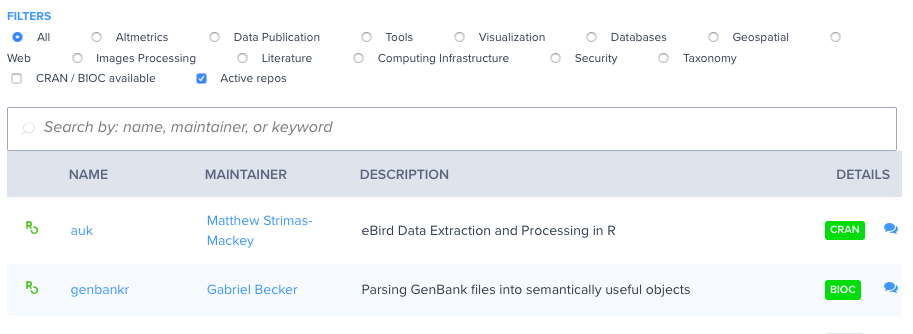
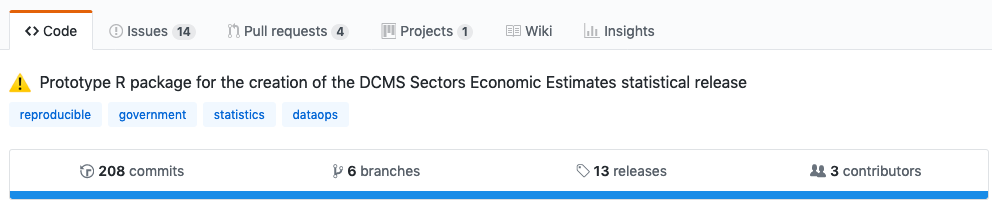

## .large[codemetar: rOpenSci Pkgs]

[leverage codemetar to build rOpenSci package registry](https://github.com/ropenscilabs/makeregistry/)



asd

---

## .large[assertr usage: eg 2]

[Department for Digital, Culture, Media & Sport (United Kingdom)](https://github.com/DCMSstats) - [creation of the DCMS Sectors Economic Estimates statistical release](https://github.com/DCMSstats/eesectors)



```r
assertr::insist_(
  x,
  assertr::within_n_mads(3),
  lazyeval::interp(~value, value = as.name(value)),
  error_fun = raise_issue)
```
