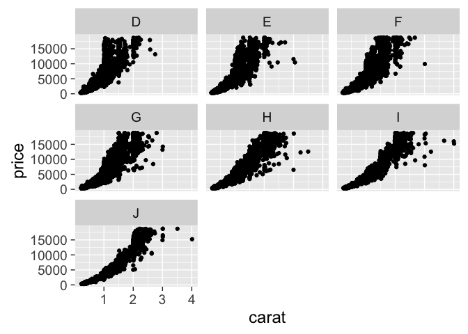

    library(ggplot2)
    library(dplyr)
    library(broom)
    library(elastic)

connect
-------

    elastic::connect()

    ## transport:  http 
    ## host:       127.0.0.1 
    ## port:       9200 
    ## path:       NULL 
    ## username:   NULL 
    ## password:   <secret> 
    ## errors:     simple 
    ## headers (names):  NULL

get some data
-------------

    # load data if not already
    res <- docs_bulk(diamonds, "diamonds")

    res <- Search(index = 'diamonds', scroll = "5m", search_type = "scan", size = 10000L)
    out <- list()
    hits <- 1
    while (hits != 0) {
      res <- scroll(scroll_id = res$`_scroll_id`)
      hits <- length(res$hits$hits)
      if (hits > 0) out <- c(out, res$hits$hits)
    }
    length(out)

    ## [1] 53939

> takes about 2 seconds

parse data to data.frame
------------------------

     -> parse data to data.frame
       -> filter, etc.
         -> statistical model on subsets
           -> plot

make data.frame

    dat <- tbl_df(do.call("rbind.data.frame", lapply(out, "[[", "_source")))

filter, remove outlier

    dat <- dat %>% dplyr::filter(cut != 'Fair', depth > 50)

group by

    (dat <- dat %>% group_by(color))

    ## Source: local data frame [52,328 x 10]
    ## Groups: color [7]
    ## 
    ##    carat       cut  color clarity depth table price     x     y     z
    ##    <dbl>    <fctr> <fctr>  <fctr> <dbl> <dbl> <int> <dbl> <dbl> <dbl>
    ## 1   0.22   Premium      F     SI1  60.4    61   342  3.88  3.84  2.33
    ## 2   0.20   Premium      E     SI2  60.2    62   345  3.79  3.75  2.27
    ## 3   0.32   Premium      E      I1  60.9    58   345  4.38  4.42  2.68
    ## 4   0.24   Premium      I     VS1  62.5    57   355  3.97  3.94  2.47
    ## 5   0.30 Very Good      J     VS2  62.2    57   357  4.28  4.30  2.67
    ## 6   0.23 Very Good      E     VS1  59.5    58   402  4.01  4.06  2.40
    ## 7   0.33     Ideal      J     SI1  61.1    56   403  4.49  4.55  2.76
    ## 8   0.30 Very Good      I     SI1  62.6    57   405  4.25  4.28  2.67
    ## 9   0.30      Good      I     SI1  63.2    55   405  4.25  4.29  2.70
    ## 10  0.31 Very Good      G     SI1  63.3    57   553  4.33  4.30  2.73
    ## # ... with 52,318 more rows

model each group

    (res <- dat %>% do(glance(lm(price ~ carat, data = .))))

    ## Source: local data frame [7 x 12]
    ## Groups: color [7]
    ## 
    ##    color r.squared adj.r.squared    sigma statistic p.value    df
    ##   <fctr>     <dbl>         <dbl>    <dbl>     <dbl>   <dbl> <int>
    ## 1      D 0.8151105     0.8150825 1442.212  29141.08       0     2
    ## 2      E 0.8389768     0.8389600 1344.791  49867.66       0     2
    ## 3      F 0.8388286     0.8388112 1526.693  48027.82       0     2
    ## 4      G 0.8747267     0.8747153 1438.109  76640.45       0     2
    ## 5      H 0.9000156     0.9000031 1336.420  71994.48       0     2
    ## 6      I 0.9129092     0.9128926 1402.384  54979.48       0     2
    ## 7      J 0.9253318     0.9253040 1217.698  33286.50       0     2
    ## # ... with 5 more variables: logLik <dbl>, AIC <dbl>, BIC <dbl>,
    ## #   deviance <dbl>, df.residual <int>

viz

    ggplot(dat, aes(carat, price)) + 
      geom_point() + 
      facet_wrap(~ color) + 
      theme_grey(base_size = 18)

