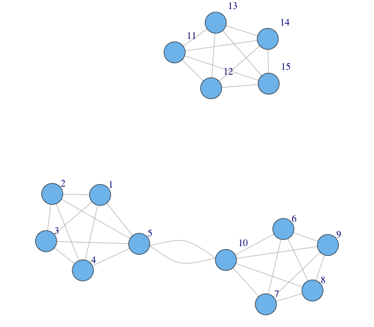
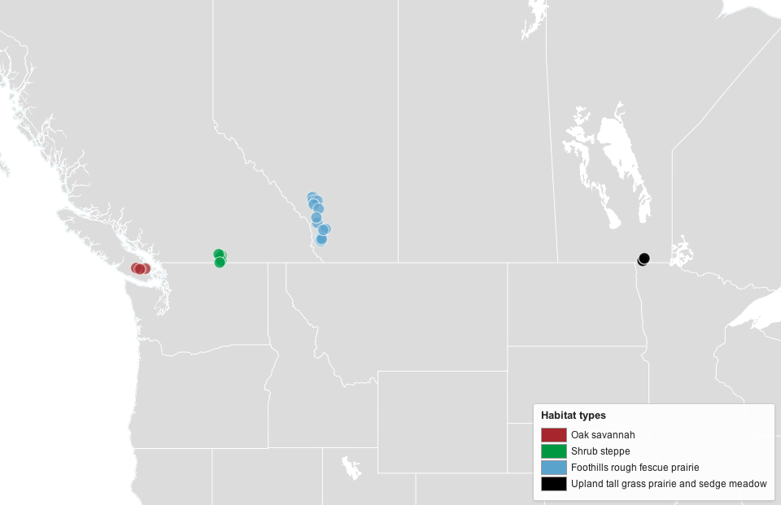
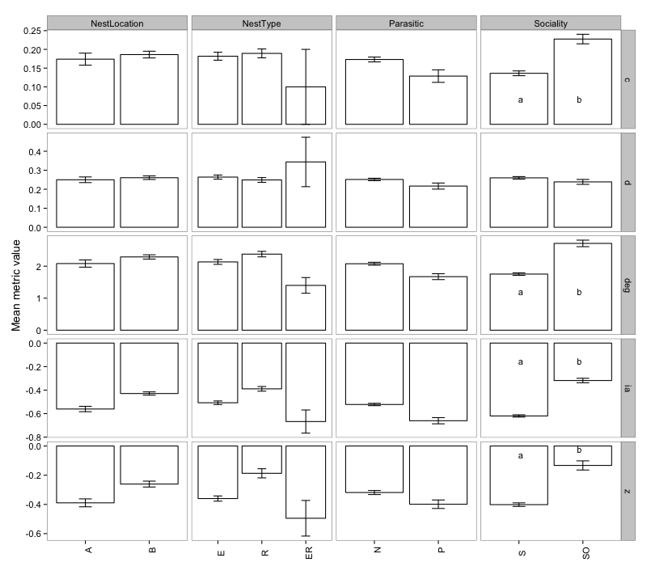
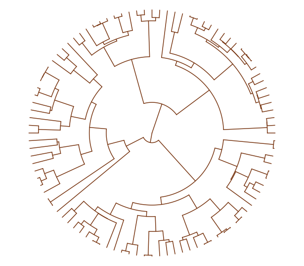
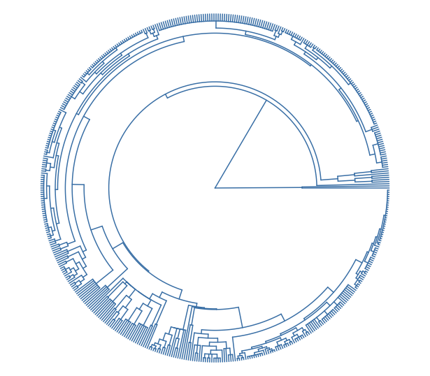
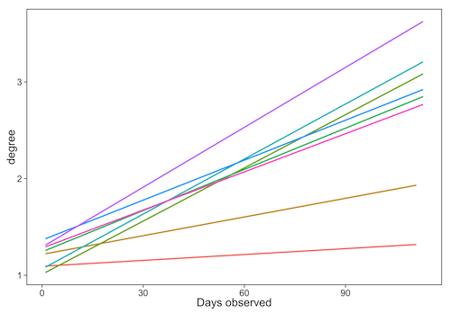
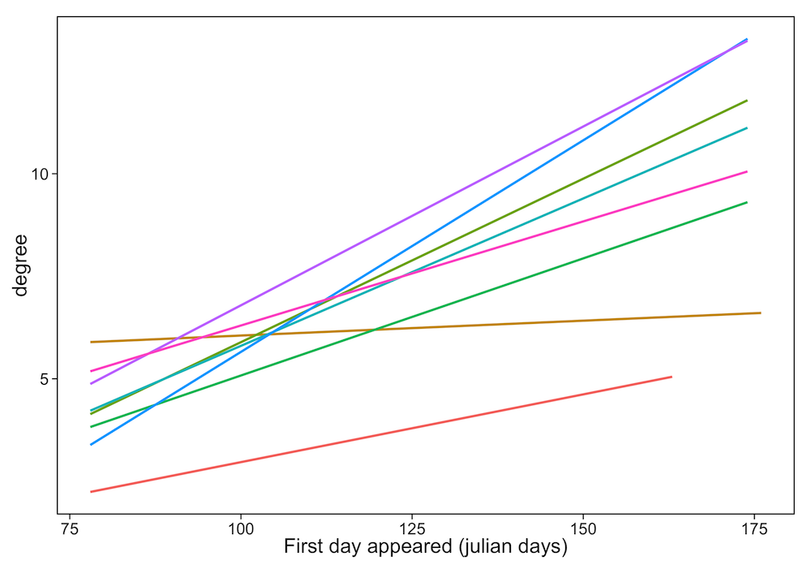

    

### Find this talk [here](http://ropensci.org/)

### Made with [Slidify](http://slidify.org/); the code [here](https://github.com/SChamberlain/posterstalks/blob/gh-pages/esa2013/openscience/index.Rmd)

### Press "o" to bring up all slides - use <i class="icon-arrow-left"> &nbsp; </i><i class="icon-arrow-right"></i> to navigate

---

## Species in communities form networks

 

---

## Patterns often similar among networks

adfsf

---

## What drives network structure?

+ Traits
+ Phylogeny
+ Phenology

---

## Study sites

---

## Traits - Pollinators

---

## Traits - Plants

--- &twocol

## Phylogeny

*** =left

**plants**

*** =right

**pollinators**

---

## Phylogeny

IMAGE

--- &twocol

## Phenology

*** =left

*** =right

---

## Conclusion

+ Sociality <i class="icon-exclamation-sign"></i> in pollinators
+ Mating systems, flower symmetry & growth form <i class="icon-exclamation-sign"></i> in plants
+ Phylogenetic distance was associated with asymmetry and degree most strongly for pollinators, and specialization and among-module connectivity for plants.
+ At network level, <i class="icon-arrow-up"></i> pollinator functional diversity w/ <i class="icon-arrow-up"></i> modularity & <i class="icon-arrow-down"></i> connectance
+ Pollinator traits bigger drivers of network structure relative to plants
+ Traits, phylogenetic history & phenology imprt

---

## Thanks!

+ <i class="icon-pencil"></i> Coauthors
  + Elizabeth Elle
  + Jana Vamosi
  + Ralph Cartar
  + Sarah Semmler
  + Anne Worley

---

  

<i class="icon-twitter icon-4x icon-dark">@recology_</i> 

