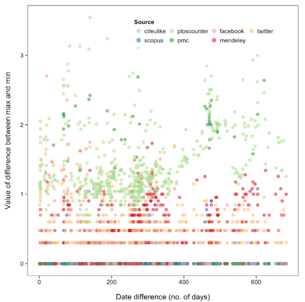

<!-- 
SHOOTING FOR 15 MIN (15-20 IS GOOD, BUT DO NO MORE THAN 15 MIN.) 
-->
<br><br><br><br>
<center></center>

---

<br><br><br><br>
<center>
### Find this talk here [http://bit.ly/roalm](http://bit.ly/roalm)

### Made with [Slidify](http://slidify.org/); the code [here](https://github.com/SChamberlain/posterstalks/blob/gh-pages/plosalm13/index.Rmd)

### Press "o" to bring up all slides - <i class="icon-arrow-left"> &nbsp; </i><i class="icon-arrow-right"></i> to navigate
</center>

---

## Two points will be made:
<br><br><br>

<font size="14"><center> Programmatic access is key <br><br>
Open altmetrics data would be nice</center></font>

---

## Programmatic access is key

<center></center>

---

## Programmatic access to altmetrics

Computers are simply better at repetitive tasks

* Makes repetitive tasks take far less time
* Facilitates tool creation by developers
* Allows research questions to be addressed more quickly
* Facilitates reproducibility

--- 

<br><br><br>
<font size="14"><center>What is needed for easy programmatic access?</center></font>

--- 

## Modern API technology: RESTful 

[REST API](http://en.wikipedia.org/wiki/REST_API) - the modern way to serve data to consumers

+ GET
+ POST
+ PUT
+ PATCH
+ HEAD
+ etc...

Makes data consumption easy from any programming language

--- 

## Good docs (for developers)

<br>
<center></center>

--- 

## Various authentication methods??
<br>
At least IMHO

OAuth makes sense for web workflows, but not so much for programmatic workflows.

--- 

## Many libraries already available, but more needed

| Data source   | Libraries            |
| ------------- | -------------        |
| PLOS ALM      | R                    |
| ImpactStory   | R, Javascript        |
| Altmetric     | R, Python, Ruby, iOS |
| PlumAnalytics | ??                   |

<!-- table of libraries available for different APIs -->

---

## Altmetrics needs researchers

<center></center>

<!-- 
if we are to avoid mistakes of JIF, we need research on altmetrics
-->

---

## How do altmetrics researchers get data?

* [Do Altmetrics Work? Twitter and Ten Other...](http://www.plosone.org/article/info%3Adoi%2F10.1371%2Fjournal.pone.0064841) - via Altmetric.com
* [Tweeting biomedicine: an analysis of tweets...](http://arxiv.org/pdf/1308.1838v1.pdf) - via Altmetric.com
* [The Spread of Scientific Information...](http://www.plosone.org/article/info%3Adoi%2F10.1371%2Fjournal.pone.0019917) - via PLOS ALM
* [Can Tweets Predict Citations? ...](http://www.jmir.org/2011/4/e123/) - via Twitter Search API
* [Altmetrics in the Wild...](http://arxiv.org/html/1203.4745v1) - via PLOS ALM, various APIs, WebofSci citations
* [Social Media Release Increases Dissemination...](http://www.ploscollections.org/article/info%3Adoi%2F10.1371%2Fjournal.pone.0068914) - via manual collection
* [Identifying Audiences of E-Infrastructures...](http://www.ploscollections.org/article/info%3Adoi%2F10.1371%2Fjournal.pone.0050943) - via Google Analytics
* [How the Scientific Community Reacts to...](http://www.plosone.org/article/info%3Adoi%2F10.1371%2Fjournal.pone.0047523) - via Twitter Search API, Google Scholar citations

---

## Obviously!

programatic access to altmetrics data
<br>
<center></center>

---

## Example in R

Load libraries, get 200 DOIs, get ALM data, plot


```r
library(rplos); library(alm); library(plyr)
dois <- searchplos(terms='*:*', fields="id", limit=200)
alm <- ldply( alm(doi=do.call(c,dois$id), total_details=TRUE) )
plot_density(alm, c("counter_pdf","mendeley_shares","pmc_pdf","pmc_total"), c("#83DFB4","#EFA5A5","#CFD470","#B2C9E4"), plot_type="h")
```


---


```r
library(rplos); library(alm); library(rCharts)
dois <- c('10.1371/journal.pone.0001543','10.1371/journal.pone.0040117','10.1371/journal.pone.0029797','10.1371/journal.pone.0039395')
dat <- signposts(doi=dois)
```


```r
plot_signposts(input = dat, type = "multiBarChart", height = 400)
```


<div id='chart41595442e577' class='rChart nvd3'></div>
<script type='text/javascript'>
 $(document).ready(function(){
      drawchart41595442e577()
    });
    function drawchart41595442e577(){  
      var opts = {
 "dom": "chart41595442e577",
"width":    800,
"height":    400,
"x": "doi",
"y": "value",
"group": "variable",
"type": "multiBarChart",
"id": "chart41595442e577" 
},
        data = [
 {
 "doi": "0040117",
"variable": "views",
"value":   1628 
},
{
 "doi": "0039395",
"variable": "views",
"value":   1035 
},
{
 "doi": "0029797",
"variable": "views",
"value":  29208 
},
{
 "doi": "0001543",
"variable": "views",
"value":   3494 
},
{
 "doi": "0040117",
"variable": "shares",
"value":      0 
},
{
 "doi": "0039395",
"variable": "shares",
"value":      0 
},
{
 "doi": "0029797",
"variable": "shares",
"value":    237 
},
{
 "doi": "0001543",
"variable": "shares",
"value":      0 
},
{
 "doi": "0040117",
"variable": "bookmarks",
"value":      8 
},
{
 "doi": "0039395",
"variable": "bookmarks",
"value":      8 
},
{
 "doi": "0029797",
"variable": "bookmarks",
"value":     51 
},
{
 "doi": "0001543",
"variable": "bookmarks",
"value":      8 
},
{
 "doi": "0040117",
"variable": "citations",
"value":      1 
},
{
 "doi": "0039395",
"variable": "citations",
"value":      0 
},
{
 "doi": "0029797",
"variable": "citations",
"value":      7 
},
{
 "doi": "0001543",
"variable": "citations",
"value":      5 
} 
]
  
      var data = d3.nest()
        .key(function(d){
          return opts.group === undefined ? 'main' : d[opts.group]
        })
        .entries(data)
      
      nv.addGraph(function() {
        var chart = nv.models[opts.type]()
          .x(function(d) { return d[opts.x] })
          .y(function(d) { return d[opts.y] })
          .width(opts.width)
          .height(opts.height)
         
        chart
  .reduceXTicks(false)
          
        

        
        
        
      
       d3.select("#" + opts.id)
        .append('svg')
        .datum(data)
        .transition().duration(500)
        .call(chart);

       nv.utils.windowResize(chart.update);
       return chart;
      });
    };
</script>


---

## Altmetric API from Python

get [here](https://pypi.python.org/pypi/altmetric)


```r
from altmetric import Altmetric
a = Altmetric()
out = a.doi('10.1126/science.1173146')
out['context']['journal']['sparkline']
```


```bash
[1994.842, 31.896, 17.45, 10.58, 8.032, 5.688, 2.85, 1, 1, 0.75]
```


---

<style type="text/css">
  table {
    border: none;
    width: 100%;
    border-collapse: collapse;
    font-size: 24px;
    line-height: 12px;
    font-family: 'Trebuchet MS';
    font-weight: bolder;
    color: rgb(102, 102, 102);
  }

  table td, table th {
    font-size: 20px;
    padding: 1em 0.5em;
  } 
</style>

## Combining metrics across aggregators

| Data source | PLoS | ImpactStory | Altmetric |
| ----------- | ---- | ----------- | --------- |
| WebOfScience | webofscience | -- | -- |
| Dryad | -- | dryad:total_downloads package_views | -- |
| Figshare | -- | figshare:views shares downloads | -- | 
| Github | -- | github:forks stars | -- |
| Google+ | -- | -- | cited by gplus count |
| MSM | -- | -- | cited by msm count |
| Scopus citations | scopus | plosalm:scopus | -- |
| Mendeley readers | mendeley shares | mendeley readers | mendeley readers |
| Twitter | twitter | topsy:tweets | cited by tweeters count |

---

## Altmetrics data will largely come from aggregators

<br>
<div class="row">
    </img>
    </img>
    </img>
    </img>
</div>

<!-- And users will get data from these, so this is where focus should be -->

---

## Why is open good?

Altmetrics needs checks on

* Consistency (tweets from source A and B should be =)
* Correlation (is metric A strongly corr. with B?)
* Interpretation (open source the interpretation)
* Gaming (security through obscurity doesn't work)

<!-- 
This can be done better when data is open and easily available.
-->

---

## Additional value comes from open altmetrics data in

* Knowledge from research findings
  * (doesn't require open data I suppose :( )
* Open products
  * [openSNP](http://opensnp.org/)
  * [ScienceCard](http://sciencecard.org/)
* For-profit products

---

## An open use case

*Are individual altmetrics consistent among data providers?*

<center></center>

---

## Transparency one of major complaints in DORA of JIF

Altmetrics APIs could provide

* Provenance for each metric
* Any data manipulation done
* Date of data collection

---

## An even better use case for open

When hefty decisions are made on the back of altmetrics, open avail. of data will pay off

* Track provenance of a metric
* What calculations were made

---

<br><br><br>
<font size="14"><center>Do we need a CommonCrawl for altmetrics?</center></font>

---

<br><br><br>

<font size="14"><center> Programmatic access <br><br>
Open altmetrics data</center></font>
