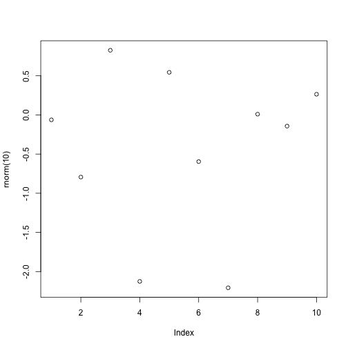

Workflow notes
======

1. Use Markdown or LaTex, MD much easier
2. Open Markdown document with some text, show rendering to HTML
3. Show Markdown w/code in code blocks, run quick output in R
4. Thats more or less reproducible, given dependencies are available

## Using Markdown is incredibly easy

You write as you normally would, with \*italics\* *italics*, **bold**, etc. 

You can easily make lists (See above). 

You can link to a URL easily, \[like this\]\(http://ropensci.org/\) [like this](http://ropensci.org/).

Blockquotes! 

\> Here's a quote

> Here's a quote

## And you can execute code along with the text

Use backticks (`), or some other convention, depending where you use Markdown

```
print("Hellow world")
```

## With some executable R code


```r
plot(rnorm(10))
```

 

