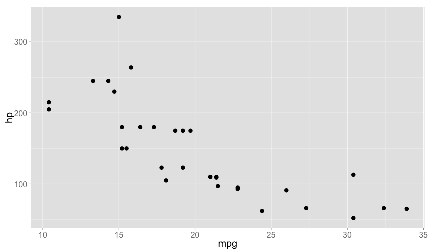
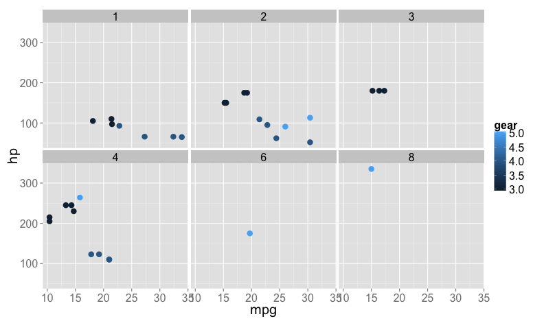

R Resources
========================================================
author: Scott Chamberlain
date: 2013-07-30
navigation: slide

Links
========================================================

### This presentation can be viewed at 

http://bit.ly/rresources

### You can use/modify/etc. the code behind this presentation at 

http://bit.ly/rresources_code

R can be your entire workflow
========================================================

+ Data
+ Manipulation
+ Visualization
+ Analysis
+ Writing

Where do I start?!
========================================================

+ Install R [from here](http://cran.r-project.org/)
+ Don't know what a function does? 

`?plot` or `??plot` for fuzzy search

or 

```r
help("plot")
help(package="ggplot2")
```

or just execute name of function to see the code

```r
plot
```

More help please!
========================================================
+ Poke around on the [The R homepage](http://cran.r-project.org/)
+ [R task views](http://cran.r-project.org/web/views/)
  + Including: bayesian stats, genetics, meta-analysis, phylogenetics, spatial stuff, etc.
+ [Nice R documentation site](http://www.rdocumentation.org/)
+ [R mailing lists](http://www.r-project.org/mail.html)
  + Topics include: general, stats, etc., and **ecology**!
  
More help please! - continued
========================================================
id: res1

#### These are the best place to ask questions, and where you will get the fastest response to a specific query (search the R tag with "`[r]`")
  + [Biostar](http://www.biostars.org/) *bionformatics* 
  + [CrossValidated](http://stats.stackexchange.com/) *statistics*
  + [Proposed Ecology stackexchange](http://area51.stackexchange.com/proposals/53186/ecology) *ecology*
  + [StackOverflow (aka SO)](http://stackoverflow.com/questions/tagged/r) *general programming*

#### Googling R? Use **"cran"** instead of **"R"** (cran=comprehensive R archive network)
+ Good for very broad searches, but you often just find stuff on the R help list or one one of the above sites

More on StackOverflow and related sites
========================================================

Some helpful tips:

+ **Do your homework.** Search around the internet, and SO itself to make sure your question hasn't been answered already.
+ **Reproducible examples.** Abstract your specific problem to a very simple case, include all data and code needed to reproduce your problem. 
+ **Learn [Markdown](http://daringfireball.net/projects/markdown/basics)** (aka MD). A very simple markup language to embed links, highlight code, emphasis, etc. 
  + MD is used to write stuff in SO, & many other places

Development versions of R packages
========================================================

Install the devtools package


```r
install.packages("devtools")
```


Install a package from [Github](https://github.com/)


```r
install_github("ggplot2")
```


Etc. for [Bitbucket](https://bitbucket.org), [gitorious](http://gitorious.org/), and locally

IDEs
========================================================

*def:* Integrated development environments

These can make R easier if you are a beginner by bringing all the pieces together (plots, code, help), and autocompleting text for you, etc. 

Highly recommend [RStudio](http://www.rstudio.com/) because

+ Cross-platform
+ Free
+ Server versions (can run in a browser = great for teaching, running on another computer)

Tasks in R
========================================================

+ Getting data

+ Manipulating data

+ Visualization

+ Analysis

+ Writing

Getting local data
========================================================

+ CSV files best


```r
read.csv("mycoolfile.csv")
```


+ Can import from XLS/XLSX too


```r
install.packages("gdata")
library(gdata)
read.xls("mycoolfile.xls", sheet="Sheet1")
```


Data on the web
========================================================
incremental: true

Um, why would I do this?

Getting data directly in R allows for reproducible workflows = data + analysis + visualizations + writing (hint: see R pkg [knitr](http://cran.r-project.org/web/packages/knitr/index.html))

Data/taxonomy/etc. constantly changing = makes sense to query for newest data

rOpenSci at [http://ropensci.org/](http://ropensci.org/)
+ We are building bridges between data on the web and R
+ GBIF, Dryad, ITIS, NCBI, Genbank, eLife, US National Phenology Network, PLOS literature, etc.

Manipulating data
========================================================

Definitely learn tools for the *split-apply-combine* strategy

+ **plyr** split apart objects, do some operation, and summarise
+ **reshape2** *melt* and *cast* data.frames & other R objects

***


*** 

<small>[Hadley Wickham (2011). The Split-Apply-Combine Strategy for Data Analysis. JSS, 40(1), 1-29.](http://www.jstatsoft.org/v40/i01) for more details</small>

plyr
========================================================
incremental: true

```r
library(plyr)
head(iris)[, c(1:2, 5)]
```

```
  Sepal.Length Sepal.Width Species
1          5.1         3.5  setosa
2          4.9         3.0  setosa
3          4.7         3.2  setosa
4          4.6         3.1  setosa
5          5.0         3.6  setosa
6          5.4         3.9  setosa
```


```r
ddply(iris, .(Species), colwise(mean))[, 1:3]
```

```
     Species Sepal.Length Sepal.Width
1     setosa        5.006       3.428
2 versicolor        5.936       2.770
3  virginica        6.588       2.974
```


reshape
========================================================
incremental: true

```r
library(reshape2)
head(iris)[1:3,]
```

```
  Sepal.Length Sepal.Width Petal.Length Petal.Width Species
1          5.1         3.5          1.4         0.2  setosa
2          4.9         3.0          1.4         0.2  setosa
3          4.7         3.2          1.3         0.2  setosa
```


```r
iris_m <- melt(iris)
head(iris_m)[1:3,1:3]
```

```
  Species     variable value
1  setosa Sepal.Length   5.1
2  setosa Sepal.Length   4.9
3  setosa Sepal.Length   4.7
```


```r
dcast(iris_m, Species ~ variable)
```

```
     Species Sepal.Length Sepal.Width Petal.Length Petal.Width
1     setosa           50          50           50          50
2 versicolor           50          50           50          50
3  virginica           50          50           50          50
```


Visualizations - base plots
========================================================


```r
plot(hp ~ mpg, data=mtcars, cex=3, cex.axis=2, cex.lab=2)
```




Visualizations - ggplot2 (learn it)
========================================================


```r
library(ggplot2)
ggplot(mtcars, aes(mpg, hp)) + 
  geom_point(size=4) +
  theme_grey(base_size=20)
```




ggplot2 - but why learn it? This -> 
========================================================


```r
library(ggplot2)
ggplot(mtcars, aes(mpg, hp, colour=gear)) +
  geom_point(size=4) +
  facet_wrap(~carb) +
  theme_grey(base_size=20)
```


Analysis
========================================================

Way too much to cover here, there can be a lot of intracacies to analyses: 

+ **Ask the authors of the packages**: email directly, probably slower than below options

+ R mailing lists, StackOverflow, etc. ([see previous slides](#/res1))

+ **CRAN Taskviews**: 
  + [Bayesian](http://cran.r-project.org/web/views/Bayesian.html)
  + [Multivariate](http://cran.r-project.org/web/views/Multivariate.html)
  + [Phylogenetics](http://cran.r-project.org/web/views/Phylogenetics.html)
  + [Timeseries](http://cran.r-project.org/web/views/TimeSeries.html)

Pulling it all together - Writing
========================================================

Highly recommend learning [knitr](http://yihui.name/knitr/)

knitr: Mix text w/ code = reproducible documents

Bonus: it's integrated in to [RStudio](http://www.rstudio.com/)

You can combine LaTeX or Markdown with your code

For Word users = try Markdown with knitr first, shallower learning curve relative to LaTeX.

`library(knitr)` then in Toolbar do *New File* then *R Markdown* to get started

Various other resources
========================================================

+ [Quick-R](http://www.statmethods.net/)
+ [R-bloggers](http://f.cl.ly/items/0B0J342n110h1p21322Y/Screen%20Shot%202013-07-25%20at%204.23.43%20PM.png) aggregates blog posts on R
+ [Nice R Code](http://nicercode.github.io/)
+ [Hadley Wickham's in prep book](https://github.com/hadley/devtools/wiki)
+ ask me! sachambe at sfu.ca
