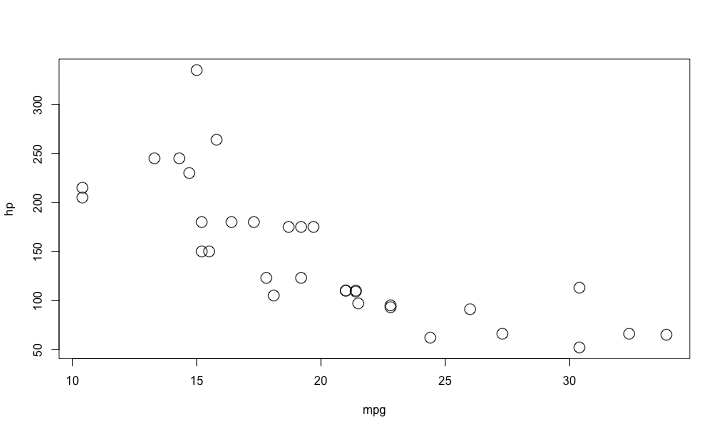

R Resources
========================================================
author: Scott Chamberlain
date: 2013-07-30
navigation: slide
font-import: http://fonts.googleapis.com/css?family=Risque
font-family: 'Risque'

Where do I start?!
========================================================

+ Install R [from here](http://cran.r-project.org/)
+ Don't know what a function does? 

```r
?plot
```

or 

```r
help("plot")
help(package="ggplot2")
```

or

```r
plot
```

More help please!
========================================================
+ You can poke around on the [The R homepage](http://cran.r-project.org/)
+ [R task views](http://cran.r-project.org/web/views/)
+ [Nice R documentation site](http://www.rdocumentation.org/)
+ [R mailing lists](http://www.r-project.org/mail.html)
  + Topics include: general, stats, etc., and **ecology**!
+ [Search the R tag on StackOverflow (aka SO)](http://stackoverflow.com/questions/tagged/r)
  + SO is the best place to ask questions, and where you will get the fastest response to a specific query
+ Googling R? Use **"cran"** instead of **"R"** (cran=comprehensive R archive network)
  + Good for very broad searches, but you often just find stuff on the R help list or on SO

More on StackOverflow
========================================================

Some helpful tips:

+ **Do your homework.** Search around the internet, and SO itself to make sure your question hasn't been answered already.
+ **Reproducible examples.** Abstract your specific problem to a very simple case, include all data and code needed to reproduce your problem. 
+ **Learn [Markdown](http://daringfireball.net/projects/markdown/basics)** (aka MD). A very simple markup language to embed links, highlight code, emphasis, etc. 
  + MD is used to write stuff in SO, & many other places

Development versions of R packages
========================================================

Install the devtools package


```r
install.packages("devtools")
```


Install a package from [Github](https://github.com/)


```r
install_github("ggplot2")
```


Etc. for [Bitbucket](https://bitbucket.org), [gitorious](http://gitorious.org/), and locally

IDEs
========================================================

*def:* Integrated development environments

These can make R easier if you are a beginner by bringing all the pieces together (plots, code, help), and autocompleting text for you, etc. 

Highly recommend [RStudio](http://www.rstudio.com/) because

+ Cross-platform
+ Free
+ Server versions (can run in a browser = great for teaching, running on another computer)

Tasks in R
========================================================

+ Getting data

+ Manipulating data

+ Visualization

+ Analysis

+ Writing

Getting data
========================================================

+ Local data: 
  + CSV files best, but 
  + Can import from XLS/XLSX too
+ Data on the web: 
  + rOpenSci at [http://ropensci.org/](http://ropensci.org/)
  + We are building bridges between data on the web and R
  + GBIF, Dryad, ITIS, NCBI, Genbank, eLife, US National Phenology Network, PLOS literature, etc.

Manipulating data
========================================================

Definitely learn:

+ **plyr** split-apply-combine strategy
+ **reshape2** *melt* and *cast* data.frames
+ **data.table** faster than plyr, only need in edge cases, harder to use

plyr
========================================================


```r
head(iris)[1:3,c(1:2,5)]
```

```
  Sepal.Length Sepal.Width Species
1          5.1         3.5  setosa
2          4.9         3.0  setosa
3          4.7         3.2  setosa
```

```r
library(plyr)
ddply(iris, .(Species), colwise(mean))[,1:3]
```

```
     Species Sepal.Length Sepal.Width
1     setosa        5.006       3.428
2 versicolor        5.936       2.770
3  virginica        6.588       2.974
```


reshape
========================================================


```r
library(reshape2)
head(iris)[1:3,3:5]
```

```
  Petal.Length Petal.Width Species
1          1.4         0.2  setosa
2          1.4         0.2  setosa
3          1.3         0.2  setosa
```

```r
head(melt(iris))[1:3,1:3]
```

```
  Species     variable value
1  setosa Sepal.Length   5.1
2  setosa Sepal.Length   4.9
3  setosa Sepal.Length   4.7
```


Visualizations - base plots
========================================================


```r
plot(mtcars$mpg, mtcars$hp, cex=2)
```




Visualization - ggplot2
========================================================


```r
library(ggplot2)
ggplot(mtcars, aes(mpg, hp)) + 
  geom_point()
```


ggplot2 - here is where the power is
========================================================


```r
library(ggplot2)
ggplot(mtcars, aes(mpg, hp, colour=gear)) +
  geom_point() +
  facet_wrap(~carb)
```


Analysis
========================================================

Way too much to cover here, there can be a lot of intracacies to analyses: 

+ **Ask the authors of the packages**: R mailing lists, StackOverflow, etc.

+ **CRAN Taskviews**: 
  + [Bayesian](http://cran.r-project.org/web/views/Bayesian.html)
  + [Multivariate](http://cran.r-project.org/web/views/Multivariate.html)
  + [Phylogenetics](http://cran.r-project.org/web/views/Phylogenetics.html)
  + [Timeseries](http://cran.r-project.org/web/views/TimeSeries.html)

Pulling it all together - Writing
========================================================

Highly recommend learning [knitr](http://yihui.name/knitr/)

knitr: Mix text w/ code = reproducible documents

Bonus: it's integrated in to RStudio

You can combine LaTeX or Markdown with your code

For Word users = try Markdown with knitr first, shallower learning curve relative to LaTeX.

Various other resources
========================================================

+ [Quick-R](http://www.statmethods.net/)
+ [R-bloggers](http://f.cl.ly/items/0B0J342n110h1p21322Y/Screen%20Shot%202013-07-25%20at%204.23.43%20PM.png) aggregates blog posts on R
+ [Nice R Code](http://nicercode.github.io/)
+ [Hadley Wickham's in prep book](https://github.com/hadley/devtools/wiki)
+ ask me! sachambe at sfu.ca
