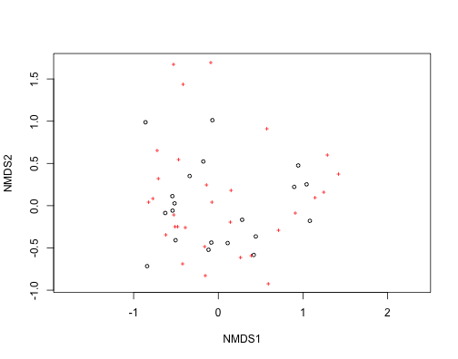

## The plan

+ General visualizations
+ Community ecology: analyses and viz
+ Networks/graphs: analyses and viz

---

## Lets have some fun first - visualizations


```r
install.packages("ggplot2")
```


```r
library(ggplot2)
ggplot(data=iris, aes(Sepal.Length, Sepal.Width, colour=Species)) +
  geom_point() + 
  scale_color_manual(values = c("#FF0000", "#0000FF", "#00FF00"))
```


---

## Terminology

+ ggplot - The main function where you specify the dataset and variables to plot
+ geom - geometric objects
  + `geom_point()`, `geom_bar()`, `geom_density()`, `geom_line()`, `geom_area()`
+ aes - aesthetics
  + shape, alpha (transparency), color, fill, linetype
+ scale - Define how your data will be plotted
  + continuous, discrete, log

---

## Building blocks, mix and match


```r
ggplot(data=iris, aes(Sepal.Length, Sepal.Width, colour=Species)) +
  geom_point()
```


OR, just do 


```r
p <- ggplot(data=iris, aes(Sepal.Length, Sepal.Width, colour=Species))
p + geom_point()
```


---

## Color by species


```r
ggplot(data=iris, aes(Sepal.Length, Sepal.Width, colour=Species)) +
  geom_point()
```


--- &twocol

## Adjust the size (and color) of points

*** =left


```r
ggplot(data=iris, aes(Sepal.Length, Sepal.Width, colour=Species)) +
  geom_point(size = 6)
```


*** =right


```r
ggplot(data=iris, aes(Sepal.Length, Sepal.Width, color=Species, size=Species)) +
  geom_point()
```


---

## Facet by species


```r
ggplot(data=iris, aes(Sepal.Length, Sepal.Width)) +
  geom_point() +
  facet_wrap(~ Species)
```


--- &twocol

## Combine geoms

*** =left

### Combine `geom_boxplot` and `geom_point`


```r
ggplot(data=iris, aes(Species, Petal.Width)) +
  geom_boxplot() +
  geom_point()
```


*** =right

### Order matters! 


```r
ggplot(data=iris, aes(Species, Petal.Width)) +
  geom_point() +
  geom_boxplot()
```


---

## Make this plot


--- 

## Saving plots using ggplot2

If the plot is on your screen

```r
ggsave("~/path/to/figure/filename.png")
```


If your plot is assigned to an object

```r
ggsave(plot1, file = "~/path/to/figure/filename.png")
```


Specify a size

```r
ggsave(file = "/path/to/figure/filename.png", width = 6, height = 4)
```


Or any format (pdf, png, eps, svg, jpg)

```r
ggsave(file = "/path/to/figure/filename.eps")
ggsave(file = "/path/to/figure/filename.jpg")
ggsave(file = "/path/to/figure/filename.pdf")
```


<!-- community structure -->
<!-- community structure -->
<!-- community structure -->

--- 

## Community structure

+ Diversity indices
+ Rarefaction - comparing diverity in different samples
+ Ordination

--- &twocol align1:left

## Diversity indices

*** =left

Shannon-Weaver


```r
library(vegan)
data(BCI)
bci_subset <- BCI[1:3, ]
head(bci_subset)[, 10:11]
```

```
  Allophylus.psilospermus Alseis.blackiana
1                       0               25
2                       0               26
3                       0               18
```

```r
(H <- diversity(bci_subset))
```

```
    1     2     3 
4.018 3.848 3.814 
```


*** =right

Simpson


```r
diversity(bci_subset, index = "simpson")
```

```
     1      2      3      4 
0.9746 0.9683 0.9646 0.9716 
```


Evenness


```r
H <- diversity(bci_subset)
H/log(specnumber(bci_subset))
```

```
     1      2      3 
0.8866 0.8686 0.8476 
```


---

## Rarefaction


```r
nosp <- specnumber(BCI)
nosp_rare <- rarefy(BCI, raremax)
df <- data.frame(nosp, nosp_rare)
head(df)
```

```
  nosp nosp_rare
1   93     84.34
2   84     76.53
3   90     79.12
4   94     82.47
5  101     86.91
6   85     78.51
```


---

## Make this plot


--- &twocol

## Rarefaction curves

*** =left 


```r
raremax <- min(rowSums(BCI))
rarecurve(BCI, step = 20, sample = raremax, col = "blue", cex = 0.6)
```


*** =right


```r
data(BCI)
sp1 <- specaccum(BCI)
sp2 <- specaccum(BCI, "random")
sp2
```

```
Species Accumulation Curve
Accumulation method: random, with 100 permutations
Call: specaccum(comm = BCI, method = "random") 

                                                                       
Sites     1.000   2.000   3.000   4.000   5.000   6.000   7.000   8.000
Richness 90.540 122.150 139.720 152.000 160.940 167.160 172.030 176.130
sd        7.328   7.606   6.914   5.841   5.373   5.095   4.929   4.915
                                                                        
Sites      9.000  10.000  11.000  12.000  13.000  14.000  15.000  16.000
Richness 179.690 182.600 185.280 187.640 190.080 192.230 194.360 196.150
sd         5.065   5.121   4.601   4.448   4.631   4.679   4.375   4.326
                                                                      
Sites     17.000  18.000  19.000  20.00  21.000  22.000  23.00  24.000
Richness 197.600 199.210 200.830 202.24 203.420 204.620 205.76 207.060
sd         4.365   4.441   4.468   4.36   4.305   4.104   3.98   3.858
                                                                        
Sites     25.000  26.000  27.000  28.000  29.000  30.000  31.000  32.000
Richness 208.460 209.450 210.330 211.250 212.250 213.110 214.010 214.700
sd         3.661   3.591   3.408   3.331   3.118   2.874   2.862   2.862
                                                                       
Sites     33.00  34.000  35.000  36.000  37.000  38.000  39.000  40.000
Richness 215.48 216.140 216.850 217.500 218.080 218.790 219.420 220.090
sd         2.83   2.704   2.516   2.572   2.537   2.467   2.483   2.417
                                                                        
Sites     41.000  42.000  43.000  44.000  45.000  46.000  47.000  48.000
Richness 220.600 221.120 221.570 222.030 222.600 223.180 223.640 223.960
sd         2.383   2.231   2.006   1.872   1.764   1.493   1.275   1.127
                   
Sites     49.00  50
Richness 224.55 225
sd         0.73   0
```

```r
summary(sp2)
```

```
 1 sites         2 sites       3 sites       4 sites       5 sites      
 Min.   : 77.0   Min.   :103   Min.   :124   Min.   :139   Min.   :147  
 1st Qu.: 85.0   1st Qu.:118   1st Qu.:136   1st Qu.:148   1st Qu.:157  
 Median : 90.0   Median :122   Median :140   Median :152   Median :161  
 Mean   : 90.5   Mean   :122   Mean   :140   Mean   :152   Mean   :161  
 3rd Qu.: 94.2   3rd Qu.:127   3rd Qu.:144   3rd Qu.:156   3rd Qu.:164  
 Max.   :109.0   Max.   :139   Max.   :154   Max.   :166   Max.   :173  
 6 sites       7 sites       8 sites       9 sites       10 sites     
 Min.   :154   Min.   :158   Min.   :163   Min.   :167   Min.   :173  
 1st Qu.:164   1st Qu.:169   1st Qu.:173   1st Qu.:175   1st Qu.:179  
 Median :168   Median :173   Median :176   Median :180   Median :183  
 Mean   :167   Mean   :172   Mean   :176   Mean   :180   Mean   :183  
 3rd Qu.:171   3rd Qu.:175   3rd Qu.:180   3rd Qu.:184   3rd Qu.:186  
 Max.   :181   Max.   :185   Max.   :190   Max.   :193   Max.   :196  
 11 sites      12 sites      13 sites      14 sites      15 sites     
 Min.   :177   Min.   :178   Min.   :179   Min.   :181   Min.   :182  
 1st Qu.:182   1st Qu.:185   1st Qu.:187   1st Qu.:189   1st Qu.:193  
 Median :185   Median :187   Median :190   Median :192   Median :194  
 Mean   :185   Mean   :188   Mean   :190   Mean   :192   Mean   :194  
 3rd Qu.:188   3rd Qu.:190   3rd Qu.:193   3rd Qu.:195   3rd Qu.:197  
 Max.   :197   Max.   :199   Max.   :200   Max.   :202   Max.   :204  
 16 sites      17 sites      18 sites      19 sites      20 sites     
 Min.   :185   Min.   :187   Min.   :188   Min.   :190   Min.   :191  
 1st Qu.:194   1st Qu.:195   1st Qu.:197   1st Qu.:198   1st Qu.:199  
 Median :196   Median :198   Median :199   Median :201   Median :202  
 Mean   :196   Mean   :198   Mean   :199   Mean   :201   Mean   :202  
 3rd Qu.:199   3rd Qu.:201   3rd Qu.:202   3rd Qu.:204   3rd Qu.:205  
 Max.   :208   Max.   :209   Max.   :209   Max.   :213   Max.   :214  
 21 sites      22 sites      23 sites      24 sites      25 sites     
 Min.   :192   Min.   :195   Min.   :196   Min.   :198   Min.   :200  
 1st Qu.:201   1st Qu.:202   1st Qu.:203   1st Qu.:204   1st Qu.:206  
 Median :203   Median :205   Median :206   Median :207   Median :208  
 Mean   :203   Mean   :205   Mean   :206   Mean   :207   Mean   :208  
 3rd Qu.:207   3rd Qu.:207   3rd Qu.:208   3rd Qu.:210   3rd Qu.:211  
 Max.   :215   Max.   :215   Max.   :216   Max.   :217   Max.   :218  
 26 sites      27 sites      28 sites      29 sites      30 sites     
 Min.   :201   Min.   :203   Min.   :204   Min.   :206   Min.   :206  
 1st Qu.:207   1st Qu.:208   1st Qu.:209   1st Qu.:210   1st Qu.:211  
 Median :209   Median :211   Median :211   Median :212   Median :213  
 Mean   :209   Mean   :210   Mean   :211   Mean   :212   Mean   :213  
 3rd Qu.:212   3rd Qu.:212   3rd Qu.:213   3rd Qu.:214   3rd Qu.:215  
 Max.   :219   Max.   :219   Max.   :220   Max.   :221   Max.   :221  
 31 sites      32 sites      33 sites      34 sites      35 sites     
 Min.   :207   Min.   :208   Min.   :210   Min.   :210   Min.   :210  
 1st Qu.:212   1st Qu.:213   1st Qu.:214   1st Qu.:214   1st Qu.:215  
 Median :214   Median :215   Median :216   Median :216   Median :217  
 Mean   :214   Mean   :215   Mean   :215   Mean   :216   Mean   :217  
 3rd Qu.:216   3rd Qu.:217   3rd Qu.:217   3rd Qu.:218   3rd Qu.:218  
 Max.   :221   Max.   :223   Max.   :223   Max.   :223   Max.   :223  
 36 sites      37 sites      38 sites      39 sites      40 sites     
 Min.   :211   Min.   :212   Min.   :213   Min.   :213   Min.   :213  
 1st Qu.:216   1st Qu.:217   1st Qu.:218   1st Qu.:218   1st Qu.:218  
 Median :218   Median :218   Median :219   Median :220   Median :221  
 Mean   :218   Mean   :218   Mean   :219   Mean   :219   Mean   :220  
 3rd Qu.:219   3rd Qu.:220   3rd Qu.:220   3rd Qu.:221   3rd Qu.:222  
 Max.   :223   Max.   :224   Max.   :224   Max.   :224   Max.   :224  
 41 sites      42 sites      43 sites      44 sites      45 sites     
 Min.   :214   Min.   :214   Min.   :215   Min.   :215   Min.   :216  
 1st Qu.:219   1st Qu.:220   1st Qu.:221   1st Qu.:221   1st Qu.:222  
 Median :221   Median :222   Median :222   Median :222   Median :223  
 Mean   :221   Mean   :221   Mean   :222   Mean   :222   Mean   :223  
 3rd Qu.:222   3rd Qu.:223   3rd Qu.:223   3rd Qu.:223   3rd Qu.:224  
 Max.   :225   Max.   :225   Max.   :225   Max.   :225   Max.   :225  
 46 sites      47 sites      48 sites      49 sites      50 sites     
 Min.   :218   Min.   :221   Min.   :221   Min.   :222   Min.   :225  
 1st Qu.:222   1st Qu.:223   1st Qu.:223   1st Qu.:224   1st Qu.:225  
 Median :223   Median :224   Median :224   Median :225   Median :225  
 Mean   :223   Mean   :224   Mean   :224   Mean   :225   Mean   :225  
 3rd Qu.:224   3rd Qu.:225   3rd Qu.:225   3rd Qu.:225   3rd Qu.:225  
 Max.   :225   Max.   :225   Max.   :225   Max.   :225   Max.   :225  
```

```r
plot(sp1, ci.type = "poly", col = "blue", lwd = 2, ci.lty = 0, ci.col = "lightblue")
boxplot(sp2, col = "yellow", add = TRUE, pch = "+")
```


--- &twocol

## Ordination

*** =left


```r
data(dune)
ord <- metaMDS(dune)
```

```
Run 0 stress 0.1193 
Run 1 stress 0.1193 
... procrustes: rmse 0.0001945  max resid 0.000581 
*** Solution reached
```

```r
plot(ord)
```


*** =right


```r
ord_axes <- data.frame(scores(ord))
ord_spp <- data.frame(scores(ord, display = "species"))
ggplot(ord_axes, aes(NMDS1, NMDS2)) + geom_point() + geom_point(data = ord_spp, 
    aes(NMDS1, NMDS2), colour = "red")
```


---


```r
ord <- metaMDS(dune)
```

```
Run 0 stress 0.1193 
Run 1 stress 0.1809 
Run 2 stress 0.1183 
... New best solution
... procrustes: rmse 0.02027  max resid 0.06498 
Run 3 stress 0.2035 
Run 4 stress 0.1193 
Run 5 stress 0.1193 
Run 6 stress 0.1183 
... New best solution
... procrustes: rmse 4.182e-05  max resid 0.0001343 
*** Solution reached
```

```r
plot(ord)
```




<!-- networks -->

--- 

## Networks

+ ad
+ ad
+ ad

---
