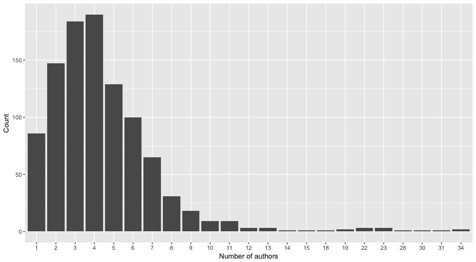
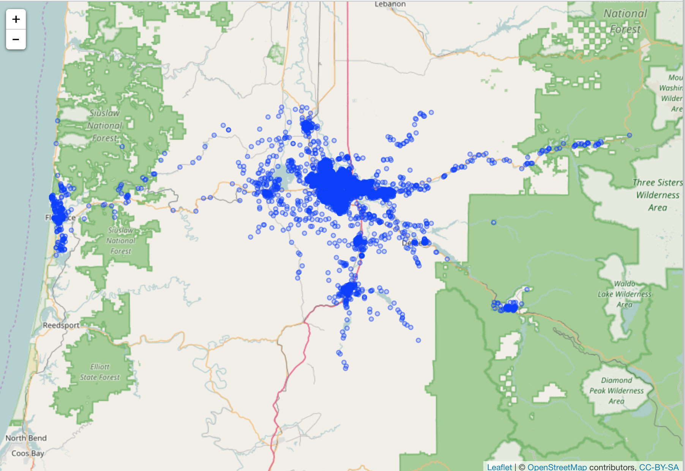

## Exercise 1

### Example

Plot number of references per article

Install packages if you don't have them installed yet

```r
# install.packages("rplos")
# install.packages("ggplot2")
# install.packages("rmarkdown")
```

Load packages 

```r
library(rplos)
library(ggplot2)

x <- searchplos(q='ecology', fl='reference', limit = 250)
no_refs <- vapply(x$data$reference, function(z) {
  length(strsplit(z, ";")[[1]])
}, integer(1), USE.NAMES = FALSE)
df <- data.frame(table(no_refs), stringsAsFactors = FALSE)

ggplot(df, aes(x = no_refs, y = Freq)) +
  geom_col() +
  labs(x = "Number of references", y = "Count") + 
  theme()
```

Save the above in a file. Render to .html

```r
library(rmarkdown)
rmarkdown::render("file.Rmd")
```

### Your turn

<details> <summary><strong>Click to expand/collapse</strong></summary><p>

```r
library(rplos)
x <- searchplos(q='ecology', fl='author', limit = 1000)
x
x$data
x$data$author
auth_split <- vapply(x$data$author, function(x) {
  length(strsplit(x, split = ";")[[1]])
}, integer(1), USE.NAMES = FALSE)
df <- data.frame(table(auth_split), stringsAsFactors = FALSE)

library(ggplot2)

ggplot(df, aes(x = auth_split, y = Freq)) +
  geom_col() +
  labs(x = "Number of authors", y = "Count")
```



Save the above in a file. Render to .html

```r
library(rmarkdown)
rmarkdown::render("file.Rmd")
```

</p></details>

## Exercise 2

Make an interactive map of some addresses in Eugene

<details> <summary><strong>Click to expand/collapse</strong></summary><p>

```r
install.packages("openadds")
install.packages("leaflet")

library(openadds)
library(leaflet)

# lane county, where Eugene is
search_res <- oa_search(state = "or")
url <- "http://data.openaddresses.io/runs/182942/us/or/lane.zip"
x <- oa_get(url)
x <- x[[1]][sample(seq_len(NROW(x[[1]])), size = 5000), ]

leaflet(x) %>%
   addTiles() %>%
   addCircles(lat = ~LAT, lng = ~LON,
              popup = unname(apply(x[, c('NUMBER', 'STREET')], 1,
              paste, collapse = " ")))
```



</p></details>
