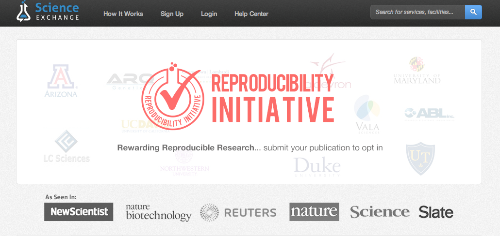

<br><br><br>

<font size="14"><center> There is a lot of open data on the web via APIs </center></font>

---


```r
list(5, 6, 7)
```

```
## [[1]]
## [1] 5
## 
## [[2]]
## [1] 6
## 
## [[3]]
## [1] 7
```


    ```{r}
    hist(rnorm(100))
    5 + 6
    ```

---

## There's also a reproduciblity crisis

<center></center>

---

## Connecting scientists to open data on the web
<br>
<center></center>

---

<center></center>

---

<center>  </center>
<br><br>
<center>  </center>

---

<br><br><br>

<font size="18"><center> <a href="http://ropensci.org/">http://ropensci.org/</a> </center></font>
<br><br>
<font size="18"><center> <a href="https://twitter.com/ropensci">@ropensci</a> </center></font>
<br><br>
<font size="18"><center> <a href="http://bit.ly/vanrtalk">http://bit.ly/vanrtalk</a> </center></font>
